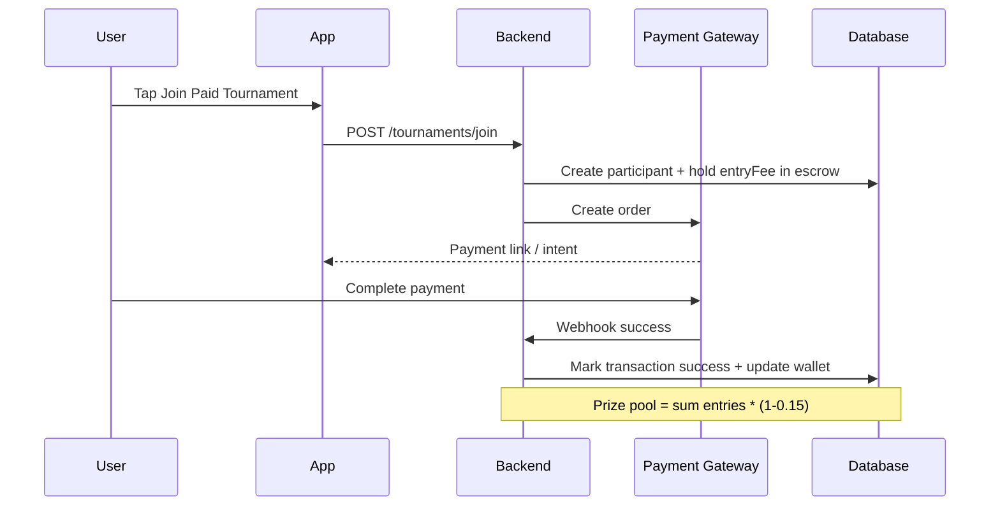

# 🔥 FF Arena - Free Fire Esports Tournament Platform

**Production-Ready Blueprint for a Scalable, Multi-Country Free Fire Tournament App**

> **App Name**: FF Arena (suggested alternatives: FireForge, FF Clash Arena, ArenaFF, ForgeFire)

**Target**: India, Bangladesh, Indonesia, Pakistan, Nepal | **Scale Goal**: 1M+ users | **Compliance**: Indian gaming laws + regional regulations

---

## 🚀 Quick Links
- [Architecture](#architecture)
- [Database Schema](#database-schema-er-diagram--prisma)
- [API Endpoints](#api-endpoints)
- [UI Wireframes](#uiux--wireframes)
- [Admin Dashboard](#admin-dashboard-web)
- [Key Flows](#key-flows-payment-anti-cheat--more)
- [Source Code Structure](#source-code-structure--folder-layout)
- [Deployment Guide](#deployment-guide)
- [Testing Checklist](#testing-checklist)

---

## Overview & Features

FF Arena is a complete esports tournament platform for Garena Free Fire. Players join solo/duo/squad/clash squad tournaments (free or paid entry), compete in auto-matched rooms, submit proof, and win real cash prizes distributed automatically via local payment methods.

### Core Features Implemented in Spec

**1. User Authentication**
- Phone OTP (Twilio/Firebase/Auth0 or custom)
- Free Fire UID verification (auto-fetch via unofficial or official API where available + manual fallback)
- Full KYC (PAN + Aadhaar for India, NID for BD, etc.)

**2. Tournament System**
- Formats: Solo, Duo, Squad (4), Clash Squad
- Types: Free Entry (practice) & Paid (cash)
- Entry fees: ₹0, ₹10, ₹25, ₹50, ₹100, ₹500, ₹1000
- Auto-matchmaking by rank tier (Bronze→Grandmaster)
- Room ID/Password shared 15 min before via push + in-app
- Live bracket / elimination view

**3. Prize & Payout**
- Escrow wallet system (platform holds entry fees + prize pool)
- Auto or admin-verified distribution
- Withdrawals: UPI (IN), bKash (BD), GoPay/OVO/Dana (ID), Easypaisa/JazzCash (PK)
- Min ₹50 | Payout <24h

**4. Anti-Cheat & Fair Play**
- Mandatory post-match screenshot upload (rank proof)
- UID cross-check + manual/admin review
- Report system + auto-ban threshold (3 reports)
- Optional AI OCR for rank extraction (bonus)

**5. Leaderboards & Stats**
- Global / Regional / Monthly / Tier-based
- Player profile: Matches, Winrate, Earnings, K/D, Tier progression

**6. Social**
- Squad creation & invite (friends list)
- In-app lobby chat (Socket.io)
- Referral system: ₹50 bonus + 10% commission on referred user's first paid entry
- Share results to WhatsApp/IG Stories

**7. Admin Web Dashboard**
- Tournament CRUD
- Result verification queue
- Withdrawal approval
- Analytics (DAU/MAU, GTV, retention cohorts)
- User management + ban tools

**8. Monetization**
- 15% platform fee on paid tournaments
- Premium pass ₹99/mo (priority matchmaking, no ads, exclusive tournaments)
- Non-intrusive banner ads
- Sponsored tournaments by brands

---

## Tech Stack (Production Choice)

- **Mobile**: React Native + Expo SDK 51+ (TypeScript) - one codebase for Android + iOS
- **Backend**: Node.js 20 + Express + TypeScript + Prisma ORM
- **Database**: PostgreSQL 16 (Supabase or AWS RDS / Neon for managed)
- **Storage**: AWS S3 or Supabase Storage (for screenshots, profile pics)
- **Payments**: 
  - India: Razorpay
  - Bangladesh: SSLCommerz
  - Indonesia: Midtrans
  - Pakistan: EasyPaisa / JazzCash API adapters (pluggable)
- **Auth & OTP**: Twilio Verify or Firebase Phone Auth + custom JWT
- **Real-time**: Socket.io (lobby chat, live brackets) or Supabase Realtime
- **Push Notifications**: Firebase Cloud Messaging (FCM) + Expo Notifications
- **Admin Dashboard**: Next.js 14 (App Router) + Tailwind + Recharts
- **Hosting**: 
  - Backend: Railway / Render / AWS ECS Fargate
  - Admin: Vercel
  - Mobile: Expo EAS
- **Monitoring**: Sentry + PostHog analytics
- **CI/CD**: GitHub Actions

> **Why this stack?** Scalable, type-safe, fast development with Expo, excellent DX with Prisma. Can evolve to microservices later.

---

## Architecture

### High-Level System Architecture

```mermaid
flowchart TD
    subgraph Mobile
        RN[React Native App<br/>Expo]
    end
    subgraph Backend
        API[Node.js Express API<br/>+ Prisma]
        MM[Matchmaking Service]
        PAY[Payment Adapters]
        AC[Anti-Cheat Service]
    end
    subgraph Data
        DB[(PostgreSQL + Prisma)]
        S3[(S3 / Storage<br/>Screenshots)]
    end
    subgraph External
        FCM[Firebase Cloud Messaging]
        RAZOR[Razorpay / SSLCommerz / Midtrans]
        FF[Free Fire UID API<br/>(or manual)]
    end
    subgraph Admin
        ADMIN[Next.js Admin Dashboard]
    end

    RN -->|REST + WebSocket| API
    API --> DB
    API --> S3
    API --> PAY
    API --> FCM
    API --> MM
    API --> AC
    ADMIN --> API
    PAY --> RAZOR
    FCM --> RN
    MM --> DB
    AC --> S3
    AC --> DB
```

**Key Principles**:
- JWT + refresh tokens for auth
- Rate limiting + Zod validation on all inputs
- Row Level Security ideas via Prisma or DB policies
- Idempotent payment webhooks
- Event-driven for match result processing (BullMQ queues)

---

## Database Schema (ER Diagram + Prisma)

```mermaid
erDiagram
    USER ||--o{ WALLET : has
    USER ||--o{ TOURNAMENT_PARTICIPANT : joins
    USER ||--o{ TRANSACTION : makes
    USER ||--o{ REPORT : submits
    USER ||--o{ REFERRAL : refers
    TOURNAMENT ||--o{ TOURNAMENT_PARTICIPANT : has
    TOURNAMENT ||--o{ MATCH : spawns
    MATCH ||--o{ MATCH_PARTICIPANT : has
    MATCH ||--o{ SCREENSHOT : requires
    TOURNAMENT_PARTICIPANT ||--o{ MATCH_PARTICIPANT : participates

    USER {
        id uuid PK
        phone string UK
        ff_uid string UK
        ff_nickname string
        tier string
        kyc_status string
        referral_code string
        created_at timestamp
    }

    TOURNAMENT {
        id uuid PK
        title string
        format string
        entry_fee decimal
        prize_pool decimal
        max_players int
        start_time timestamp
        room_id string
        room_password string
        status string
        created_by uuid FK
    }

    TOURNAMENT_PARTICIPANT {
        id uuid PK
        tournament_id uuid FK
        user_id uuid FK
        team_name string
        status string
        joined_at timestamp
    }

    WALLET {
        id uuid PK
        user_id uuid FK
        balance decimal
        escrow_balance decimal
        currency string
    }

    TRANSACTION {
        id uuid PK
        user_id uuid FK
        type string
        amount decimal
        status string
        gateway string
        reference string
        created_at timestamp
    }

    MATCH {
        id uuid PK
        tournament_id uuid FK
        room_code string
        start_time timestamp
        end_time timestamp
        status string
        result_verified boolean
    }

    SCREENSHOT {
        id uuid PK
        match_id uuid FK
        user_id uuid FK
        image_url string
        ocr_rank string
        verified boolean
        uploaded_at timestamp
    }

    REPORT {
        id uuid PK
        reporter_id uuid FK
        reported_user_id uuid FK
        match_id uuid FK
        reason string
        status string
    }
}
```

### Prisma Schema Snippet (backend/prisma/schema.prisma)

```prisma
model User {
  id            String   @id @default(uuid())
  phone         String   @unique
  ffUid         String?  @unique
  ffNickname    String?
  tier          String   @default("Bronze")
  kycStatus     String   @default("pending")
  referralCode  String?  @unique
  createdAt     DateTime @default(now())
  wallet        Wallet?
  participants  TournamentParticipant[]
  transactions  Transaction[]
  screenshots   Screenshot[]
  reportsMade   Report[]         @relation("Reporter")
  reportsAgainst  Report[]       @relation("Reported")
}

model Tournament {
  id          String   @id @default(uuid())
  title       String
  format      String   // SOLO | DUO | SQUAD | CLASH_SQUAD
  entryFee    Decimal  @db.Decimal(10,2)
  prizePool   Decimal  @db.Decimal(10,2)
  maxPlayers  Int
  startTime   DateTime
  roomId      String?
  roomPassword String?
  status      String   @default("upcoming") // upcoming, ongoing, completed, cancelled
  createdBy   String
  participants TournamentParticipant[]
  matches     Match[]
}

// ... (full schema in repo docs or expand as needed)
model Wallet {
  id             String @id @default(uuid())
  userId         String @unique
  balance        Decimal @default(0) @db.Decimal(12,2)
  escrowBalance  Decimal @default(0) @db.Decimal(12,2)
  currency       String @default("INR")
  user           User   @relation(fields: [userId], references: [id])
}

// Add models for Match, Screenshot, Transaction, Report, LeaderboardSnapshot etc.
```

---

## API Endpoints

**Base URL**: `https://api.ffarena.com/v1`

All responses wrapped: `{ success: boolean, data?: any, error?: string, meta?: object }`

### Auth
- `POST /auth/otp/send` — { phone, countryCode }
- `POST /auth/otp/verify` — { otpId, code } → { token, user }
- `POST /auth/verify-ff-uid` — { ffUid } → profile data or error
- `POST /auth/kyc/submit` — form data + docs

### Tournaments
- `GET /tournaments` — list with filters (format, entryFee, status, tier)
- `GET /tournaments/:id`
- `POST /tournaments/:id/join` — { teamName?, members? }
- `POST /tournaments/:id/leave`
- `GET /tournaments/:id/bracket`
- `POST /tournaments/:id/room` (admin or auto 15min before)

### Matches & Results
- `POST /matches/:id/upload-proof` — multipart form (screenshot)
- `GET /matches/:id`
- `POST /matches/:id/report` — { reason }

### Wallet & Payments
- `GET /wallet`
- `POST /wallet/deposit` — { amount, gateway }
- `POST /wallet/withdraw` — { amount, method, details }
- `GET /transactions`
- Webhook: `POST /webhooks/razorpay` etc. (idempotent)

### Leaderboard
- `GET /leaderboard/global`
- `GET /leaderboard/regional?country=IN`
- `GET /leaderboard/monthly`
- `GET /profile/:userId/stats`

### Social & Referral
- `POST /squads/create`
- `POST /referrals/apply` — { code }
- `GET /referrals/earnings`

### Admin (protected + role)
- `POST /admin/tournaments`
- `PUT /admin/tournaments/:id/verify-result`
- `GET /admin/withdrawals/pending`
- `POST /admin/withdrawals/:id/approve`
- `GET /admin/analytics`

Full OpenAPI spec can be added with swagger in backend.

---

## UI/UX & Wireframes

**Theme**: Dark gaming aesthetic
- Background: #0F0F1A or #1A1A2E
- Primary accent: #FF6B00 (Free Fire orange)
- Secondary: #FFD700 (yellow)
- Text: #FFFFFF / #CCCCCC
- Cards: subtle gradients + neon borders

**Bottom Navigation** (5 tabs):
Home | Tournaments | Leaderboard | Wallet | Profile

### 1. Home Screen Wireframe (Text Mock)

```
+-----------------------------------+
| [FF Arena Logo]      [Balance ₹250] [🔔] |
+-----------------------------------+
|                                   |
|   🔥 HOT: Squad Paid ₹500 entry   |
|   2,847 joined | Starts in 1h 23m   |
|          [JOIN NOW - Orange]      |
+-----------------------------------+
| Quick Play                        |
| [Solo] [Duo] [Squad] [Clash]      |
+-----------------------------------+
| Upcoming Tournaments (horizontal) |
| [Card: Solo ₹25 | ₹2.5k prize | 87/128] |
| [Card: ... ]                      |
+-----------------------------------+
| Your Stats: 42 matches | 68% WR   |
+-----------------------------------+
```

### 2. Tournaments Screen
List view + filters (Format chips, Entry fee slider, Time). One-tap join with confirmation modal showing escrow note.

### 3. Leaderboard Screen
Tabs: Global | India | This Month
Infinite scroll cards with rank, avatar, name, tier badge, earnings.

### 4. Wallet Screen
Balance big number
- Deposit button (opens gateway sheet)
- Withdraw (KYC check + form)
- Transaction history list

### 5. Profile Screen
Avatar + FF UID + Tier progress bar
Stats grid
Referral code share button
KYC status badge
Logout

**Loading States**: Custom Lottie gaming animations (spinning FF logo or particles).

**Real-time**: Countdown timers using date-fns + socket updates for room password reveal.

---

## Admin Dashboard (Web)

Built as separate Next.js app or /admin route.

**Main Sections**:
- **Tournament Management**: Create form (format, fees, schedule, prize split rules). Edit status. Bulk actions.
- **Result Verification Queue**: List of pending matches with uploaded screenshots + player UIDs. Approve/Reject + auto payout trigger.
- **Withdrawals**: Table with user details, amount, method. Approve/Reject buttons + notes. Bulk export.
- **Analytics Dashboard**: Cards for DAU, MAU, Total Entry Fees, Platform Revenue (15%), Retention curve (chart). Country breakdown.
- **User Management**: Search users, view KYC docs, ban/unban with reason log, adjust tiers manually.

**Tech for Admin**: Next.js + shadcn/ui + TanStack Table + Recharts. Role-based access (admin/superadmin).

---

## Key Flows

### Payment + Escrow Flow (Mermaid Sequence)



### Anti-Cheat Verification Flow

1. Match ends → Push notification "Upload your rank screenshot now"
2. User uploads image (mandatory, 5 min timer)
3. Backend stores in S3 + triggers OCR job (optional AI: Google Vision or Tesseract)
4. Admin queue or auto-compare: screenshot rank vs claimed + FF UID history
5. If mismatch or suspicious: flag for manual review + hold payout
6. 3+ reports from other players → auto temporary ban + review
7. Verified clean → trigger auto prize distribution to wallets

**Bonus AI**: Integrate OCR to pre-fill rank, reduce admin load 60%+.

### Withdrawal Flow
User requests → KYC check → Sufficient balance → Create payout request → Admin/ auto approve (for small amounts) → Gateway payout API → Webhook confirmation → Wallet update + notification.

---

## Source Code Structure (Folder Layout)

```
ff-arena/
├── mobile/                     # React Native (Expo)
│   ├── app/                     # Expo Router screens or navigation
│   ├── components/              # Reusable UI (Button, TournamentCard, TierBadge)
│   ├── hooks/                   # useWallet, useTournament, useAuth
│   ├── services/                # api.ts (axios instance), supabase.ts or custom
│   ├── utils/                   # formatters, validators, countryConfig
│   ├── assets/                  # images, Lottie files
│   ├── package.json
│   ├── app.json / eas.json
│   └── ...
├── backend/
│   ├── src/
│   │   ├── controllers/         # tournamentController.ts, walletController.ts
│   │   ├── routes/              # auth.routes.ts, tournament.routes.ts
│   │   ├── services/            # PaymentService.ts (adapter pattern), MatchmakingService.ts, AntiCheatService.ts
│   │   ├── middleware/          # auth.middleware.ts, rateLimit.ts, validate.ts (zod)
│   │   ├── utils/               # countryPaymentMapper.ts
│   │   └── app.ts / server.ts
│   ├── prisma/
│   │   ├── schema.prisma
│   │   └── migrations/
│   ├── package.json
│   ├── tsconfig.json
│   └── .env.example
├── admin/                      # Next.js Admin Dashboard (optional)
│   ├── app/                     # dashboard, tournaments, withdrawals pages
│   ├── components/
│   ├── lib/                     # api client
│   └── package.json
├── docs/                       # Additional detailed docs
├── .github/workflows/          # ci.yml, deploy-backend.yml
├── docker-compose.yml          # postgres + redis local dev
├── package.json                # root for monorepo scripts
├── README.md
└── .gitignore
```

**Starter Code Examples** (in actual repo files or expand):

- `backend/src/app.ts`: Express app with helmet, cors, rateLimit, prisma middleware
- `mobile/services/api.ts`: Axios with JWT interceptor + refresh logic

---

## Deployment Guide (Step-by-Step)

1. **Clone & Setup**
   ```bash
   git clone https://github.com/tharolankit19-create/ff-arena.git
   cd ff-arena
   ```

2. **Database**
   - Create Postgres on Supabase/Neon/AWS RDS
   - `cd backend && npx prisma migrate dev`
   - Seed initial tiers, sample tournaments

3. **Backend (Railway example)**
   - Connect GitHub repo
   - Add env vars (DATABASE_URL, JWT_SECRET, RAZORPAY_KEY, FCM_SERVER_KEY, etc.)
   - Deploy → get API URL

4. **Mobile**
   - `cd mobile && npm install && npx expo start`
   - For production: `eas build --platform android` (or iOS)
   - Submit to Play Store / App Store (age rating 12+ or 16+)

5. **Admin**
   - Deploy to Vercel, set API base URL

6. **Payments**
   - Configure webhooks in each gateway dashboard pointing to your /webhooks/*
   - Test in sandbox mode first

7. **Domain & SSL**
   - api.ffarena.com, admin.ffarena.com via Cloudflare or AWS

**Env Example** (backend/.env):
```
DATABASE_URL=postgresql://...
JWT_SECRET=supersecret
PORT=3000
RAZORPAY_KEY_ID=rzp_test_xxx
# country specific keys
```

---

## Testing Checklist

- [ ] Unit tests (Jest) for services (matchmaking logic, escrow calc)
- [ ] Integration tests for payment webhooks (idempotency)
- [ ] E2E mobile (Maestro or Detox): join tournament → upload proof → receive payout
- [ ] Load test critical paths (k6): 10k concurrent joins
- [ ] Security: OWASP ZAP scan, dependency audit, JWT expiration tests
- [ ] Anti-cheat scenarios: fake screenshot, multiple accounts, report abuse
- [ ] Compliance: 18+ gate, T&Cs, responsible gaming message, regional payment success rates
- [ ] Analytics events tracked (PostHog)
- [ ] Push notifications delivery test across regions

---

## Bonus Features (Implementation Notes)

- **Live Streaming**: Embed YouTube/Twitch player in match lobby. Or custom RTMP ingest for pro events.
- **AI Result Verification**: On screenshot upload, call Vision API or self-hosted OCR → parse rank/ kills → auto-verify or flag.
- **Tournament Reminders**: Scheduled jobs (BullMQ) + FCM 30min/15min before.
- **Mini-games while waiting**: Simple React Native game (tap to shoot targets) for engagement.
- **Clans/Pro Leagues**: Separate table + registration flow for team-based pro tournaments.

---

## Security & Legal Notes

- All sensitive routes protected by JWT + role middleware
- Rate limiting per IP/user
- Input sanitization + Zod schemas
- Screenshots stored with signed URLs, never public list
- **Important**: Real-money gaming laws vary by Indian state and country. This is a **skill-based contest platform**. Consult lawyer for disclaimers, age gates (18+), and geo-fencing if needed. Platform fee model is standard.

---

## Next Steps & Roadmap

1. Scaffold full Prisma schema + seed data
2. Implement core auth + tournament join flow in backend + mobile
3. Add payment adapters one country at a time
4. Build admin verification UI
5. Add matchmaking algorithm (ELO-like or simple tier bucket)
6. Production deploy + Play Store submission
7. Add AI OCR + live features

**This repo contains the complete blueprint to build a world-class FF tournament app. Star it, fork it, and start building!**

---

*Built with passion for esports by Grok + xAI | Production-ready spec v1.0 | June 2026*

**Repo URL**: https://github.com/tharolankit19-create/ff-arena